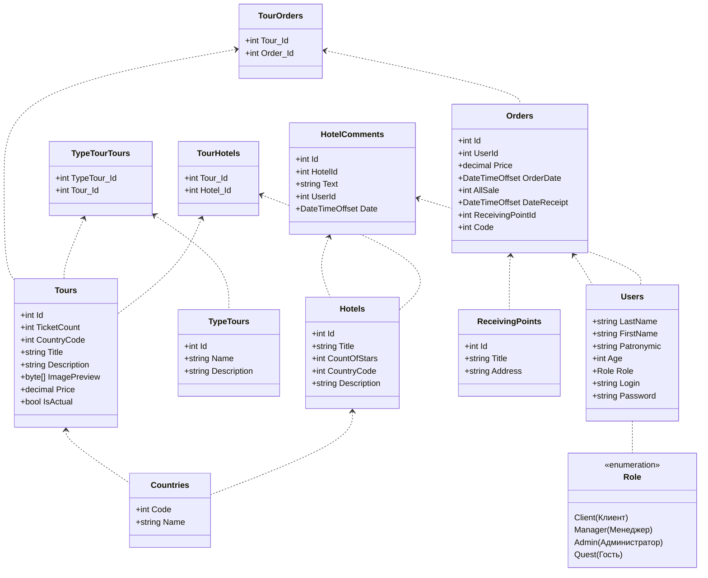

Задание Туры
---
Этот репозитоий содкржит smelling code так как это подготовка к экзамену на 2 часа 30 минут.

Автор
---
Кочетков Денис Александрович студент группы ИП 20-3

Схема моделей
---

```mermaid
    classDiagram
    TourOrders <.. Tours
    TourOrders <.. Orders
    Tours <.. Countries
    TypeTourTours <.. Tours
    TypeTourTours <.. TypeTours
    Orders <.. Users
    Orders <.. ReceivingPoints
    HotelComments <.. Users
    HotelComments <.. Hotels
    Hotels <.. Countries
    TourHotels <.. Hotels
    TourHotels <.. Tours
    Users .. Role
   
    class Users {
        +string LastName
        +string FirstName
        +string Patronymic
        +int Age
        +Role Role
        +string Login
        +string Password
    }
    class Countries {
        +int Code
        +string Name
    }
    class HotelComments {
        +int Id
        +int HotelId
        +string Text
        +int UserId
        +DateTimeOffset Date
    }
    class Hotels {
        +int Id
        +string Title
        +int CountOfStars
        +int CountryCode
        +string Description
    }
    class TypeTours {
        +int Id
        +string Name
        +string Description
    }
    class ReceivingPoints {
        +int Id
        +string Title
        +string Address
    }
    class Orders {
        +int Id
        +int UserId
        +decimal Price
        +DateTimeOffset OrderDate
        +int AllSale
        +DateTimeOffset DateReceipt
        +int ReceivingPointId
        +int Code
    }
    class Tours {
        +int Id
        +int TicketCount
        +int CountryCode
        +string Title
        +string Description
        +byte[] ImagePreview
        +decimal Price
        +bool IsActual
    }
    class TourOrders {
        +int Tour_Id
        +int Order_Id        
    }
    class TourHotels {
        +int Tour_Id
        +int Hotel_Id        
    }
    class TypeTourTours {
        +int TypeTour_Id
        +int Tour_Id        
    }
    class Role {
        <<enumeration>>
        Client(Клиент)
        Manager(Менеджер)
        Admin(Администратор)
        Quest(Гость)
    }
```
